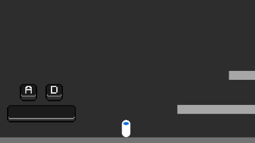
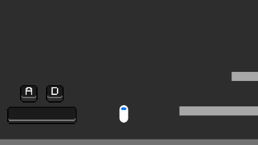
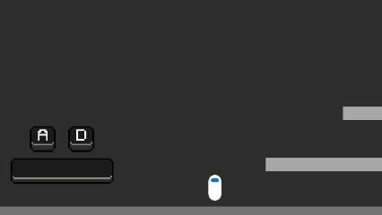
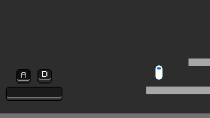

# 2D Character Controller
*A lightweight and extensible 2D platformer controller for Unity.*

A clean, modular, physics-based 2D character controller built in Unity.  
Designed as a **template** or **starting point** for platformer games, with clear C# scripts that can be easily extended (dash, wall-jump, better jump curves, animations, etc.).

---

## Preview  

---

## Features

### Core Movement
- Smooth left/right movement  
- Jumping with adjustable jump height  
- Kinematic Rigidbody2D-driven physics  
- Ground detection using CapsuleCast  
- Clean separation of input & physics

### Extensible System
- Modular scripts  
- Easy to add:  
  - Dash  
  - Double jump  
  - Wall jump  
  - Better gravity  
  - Coyote time  

###  Inspector-Friendly
- All movement stats exposed in Inspector  
- Ground detection settings configurable  
- Supports Unity Input or custom input system  

---

##  How It Works (Conceptual)

1. **Input layer** (`InputManager`):
   - Collects per-frame player intent (horizontal axis, jump pressed).
   - Produces a `FrameInput` struct used by the controller.

2. **Controller layer** (`PlayerController`):
   - Reads `FrameInput` each frame and applies movement logic in `FixedUpdate()` for deterministic physics.
   - Uses `Rigidbody2D` for movement and `CapsuleCollider2D` for collisions.
   - Uses `Physics2D.CapsuleCast` (or similar) for ground checks to determine when jumping is allowed.

3. **Extensions**:
   - Animation and audio components subscribe to the controller's state (isGrounded, velocity, isJumping).
   - Additional mechanics (dash/wall-jump/double-jump) extend the controller through small modular functions.

---

## Installation and Setup
1. **Clone Repo**
   - git clone https://github.com/AdamDoyle2056/2D_Character_Controller.git
     
2. **Open Unity**
   - Recommended: Unity 2021.x or later (project settings saved for a recent LTS).
   - Open the project folder in the Unity Hub.

3. **Scene Setup**
   - Open SampleScene.unity.
   - Add a Player GameObject (or use the provided prefab).
   - Ensure the Player has:
     - Rigidbody2D (set Body Type Dynamic)
     - CapsuleCollider2D (fit to sprite)
     - PlayerController (script)
   - Create ground/platforms using Tilemap or Sprite objects with Collider2D components, and set their Layer to a layer included in       groundLayerMask.
  
4. **Input**
   - Uses Unity's default Input Manager mapping (Horizontal axis and Jump). You can swap to the new Input System by replacing InputManager with your own implementation.

---

## Contact
- Feel free to use this template in your games!
- Adam Doyle, Final year Computer Scientist Griffith Uni https://github.com/AdamDoyle2056
